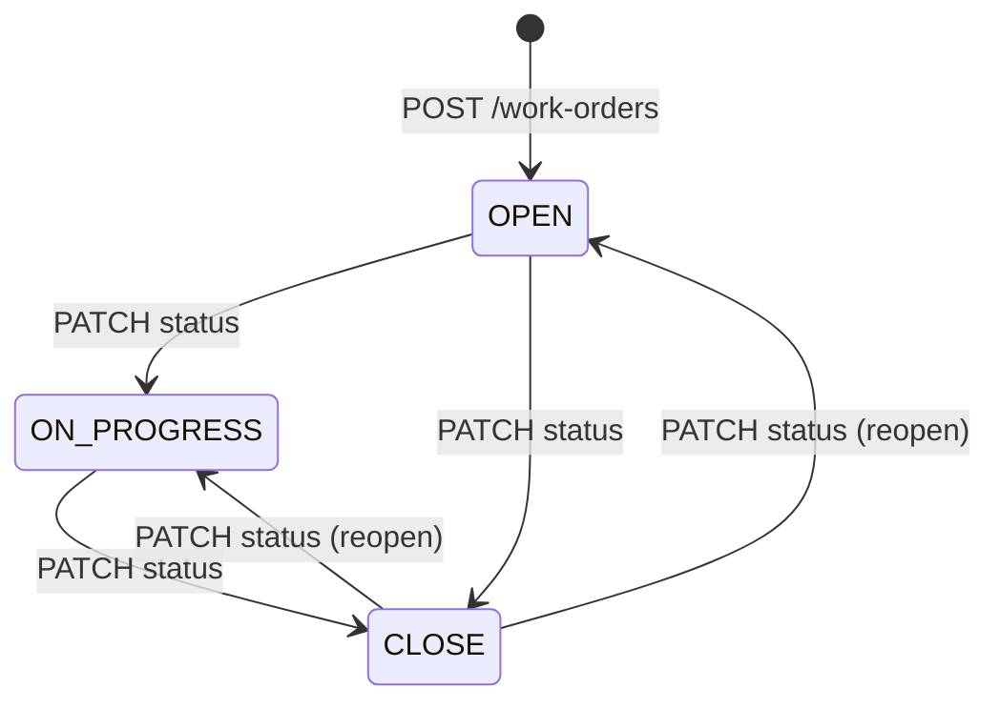
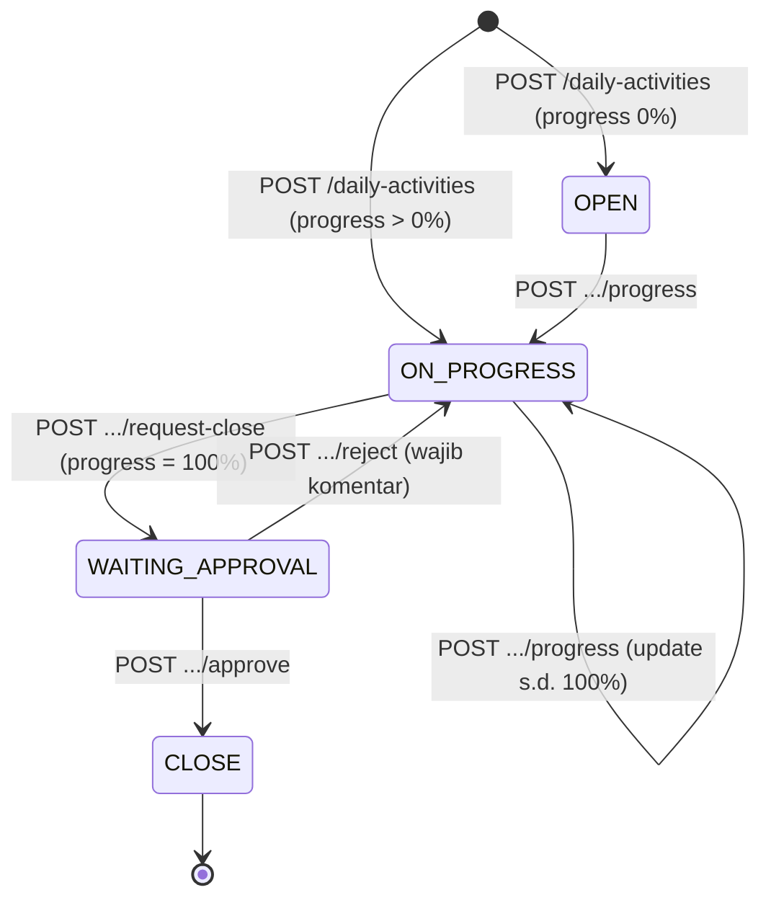
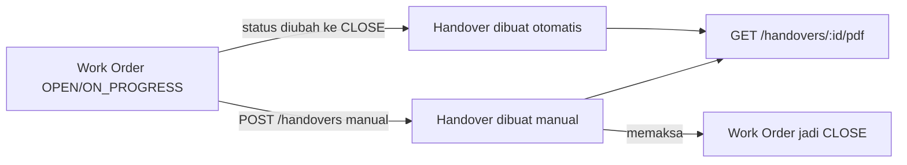

# Alur Bisnis Backend (HCGA)

Dokumen ini menjelaskan alur proses bisnis pada backend NestJS ini (bukan arsitektur kode), mencakup modul: **Auth/Users**, **Work Order**, **Daily Activity**, **Handover**, dan **Inventory**.

## 1. Peran Pengguna

`UserRole`: `SECTION_HEAD`, `GRUP_LEADER`, `ADMIN` (default `ADMIN`).

- Semua endpoint hanya mensyaratkan JWT valid (`JwtAuthGuard`) — belum ada pembatasan akses per-role di level route (`RolesGuard`) untuk sebagian besar modul.
- Satu-satunya pembatasan role eksplisit ada di **Daily Activity**: approve/reject penutupan hanya untuk `SECTION_HEAD`, `GRUP_LEADER`, `ADMIN` (`ensureApprover`).
- Endpoint auth: `POST /auth/login`, `GET /auth/profile`, `PATCH /auth/profile`, `PATCH /auth/change-password`.

## 2. Work Order

**Status:** `OPEN → ON_PROGRESS → CLOSE`
**Prioritas:** `P1`, `P2` | **PIC:** `GA_INFRAS`, `GA_ELECTRIC`



- Dibuat via `POST /work-orders` oleh user login mana pun (`createdBy`).
- Nomor dokumen otomatis: `NNN/WO/PPA-ADARO/<bulan-romawi>/<tahun>` (`DocumentNumberService`).
- Foto pekerjaan: `POST /work-orders/:id/images` (jpg/png/webp, maks 50), `DELETE /work-orders/:id/images/:filename`.
- PDF: `GET /work-orders/:id/pdf`.
- **Trigger penting:** saat status diubah menjadi `CLOSE`, sistem otomatis:
  - Menghitung `closedAt` dan `closedDurationDays`.
  - **Membuat Handover otomatis** (`autoCreated: true`, catatan "Serah terima otomatis dari Work Order status CLOSE"), data penerima diisi dari data Work Order.
  - Jika status ditarik keluar dari `CLOSE`, Handover terkait ikut **dihapus**.
- `GET /work-orders/available-for-handover` — daftar WO berstatus `OPEN`/`ON_PROGRESS` yang belum punya Handover, dipakai untuk pembuatan Handover manual.
- Catatan: `work-orders.service.before-stp-sync.ts` hanyalah berkas backup dari refactor lama — tidak ada sinkronisasi eksternal aktif di kode saat ini.

## 3. Daily Activity

**Tipe:** `DAILY_ACTIVITY`, `GRASS_CUTTING`
**Status:** `OPEN → ON_PROGRESS → WAITING_APPROVAL → CLOSE` (atau kembali ke `ON_PROGRESS` jika ditolak)
**Approval:** `NONE → PENDING → APPROVED` / `REJECTED`



- Pembuatan wajib menyertakan `profilePhotoPath` dan minimal satu `preActivityPhotoPaths`.
- Update progres (`POST /daily-activities/:id/progress`) wajib foto pre-activity + foto progres tiap update; progres di-cap 100%; tanggal tidak boleh mundur dari tanggal mulai/progres terakhir; ditolak jika status `CLOSE` atau `WAITING_APPROVAL`.
- Jika sebelumnya `REJECTED`, submit progres baru akan mereset `approvalStatus` ke `NONE`.
- Request tutup (`request-close`) hanya bisa saat progres 100% → status jadi `WAITING_APPROVAL`, `approvalStatus = PENDING`.
- Approve (oleh `SECTION_HEAD`/`GRUP_LEADER`/`ADMIN`) → status `CLOSE`, `approvalStatus = APPROVED`, tercatat di `DailyActivityApproval`.
- Reject (wajib komentar) → status kembali `ON_PROGRESS`, `approvalStatus = REJECTED`, `closeRequestedAt`/`closedAt` direset.
- Edit (`PATCH`) dan delete diblokir setelah status `CLOSE`.
- Dokumen HSE terkait namun berdiri sendiri (tidak terhubung FK ke Work Order/Handover): `PreActivityCheck` (checklist JSA/APD + tanda tangan pelaksana & pengawas), `PostActivity` (laporan harian: cuaca, jumlah tenaga kerja), `P5mMeeting`, `SafetyMeeting`, `CoordinatorSignature`.

## 4. Handover (Serah Terima)

Tidak punya status sendiri — relasi 1:1 dengan Work Order (`workOrderId` unik).



- **Otomatis:** dibuat saat Work Order berpindah ke `CLOSE` (lihat bagian 2), field penerima diisi otomatis dari data Work Order, `autoCreated = true`.
- **Manual:** `POST /handovers` — hanya boleh jika Work Order target berstatus `OPEN`/`ON_PROGRESS` dan belum punya Handover; pembuatan ini otomatis mengubah Work Order menjadi `CLOSE`.
- Nomor dokumen: `NNN/STP/PPA-ADARO/<bulan-romawi>/<tahun>` (`stpNumber`, unik).
- Field: nama/jabatan/departemen penerima, lokasi, catatan serah terima, `documentationPaths` (foto), serta tanda tangan pihak terkait.
- `PATCH /handovers/:id` tidak boleh mengubah `workOrderId`.
- PDF: `GET /handovers/:id/pdf`.

## 5. Inventory

**Scope:** `GENERAL`, `MESS`, `ELECTRIC` | **Kategori Item:** `ATK`, `HOUSEKEEPING`, `BAJU`

```mermaid
flowchart LR
    Item[Item master\n(kode otomatis per kategori)] --> Stock[InventoryStock\n(1 baris per item)]
    StockIn[Stock In] -->|increment qty| Stock
    StockOut[Stock Out] -->|decrement qty| Stock
    StockOut -->|edit/undo| Stock
```

- **Master item**: unik per `[inventoryScope, code]`; kode otomatis sesuai prefix kategori (ATK, HS untuk Housekeeping, BJ untuk Baju).
- **Stock In** (`POST /inventory/stock-ins`, batch `POST /inventory/stock-ins/batch`) → menambah `InventoryStock.quantity`.
- **Stock Out** (`POST /inventory/stock-outs`, batch `POST /inventory/stock-outs/batch`) → mengurangi quantity; mencatat `taker`, `department`, `description`, `photoPath`. Edit/undo membalik delta kuantitas secara otomatis.
- **Varian per area/scope**: `inventory-area/:scope` — endpoint item/stock/stock-in/stock-out yang sama tapi terpartisi per scope (`GENERAL`, `MESS`, `ELECTRIC`).
- **Varian Electric**: `inventory-area/ELECTRIC/stock-outs` — alur stock-out khusus yang mewajibkan foto:
  - `POST .../batch-upload` (multipart: tanggal, taker, description, `items[]` JSON, 1 foto)
  - `PATCH :id/edit-upload`
  - `GET .../photo/:filename`

## 6. Relasi Antar Modul

- Satu-satunya relasi FK lintas modul adalah **Work Order 1—1 Handover** (`workOrderId`) — status Work Order menjadi `CLOSE` adalah pemicu utama pembuatan/penghapusan Handover.
- **Daily Activity**, **Inventory**, dan dokumen HSE (**PreActivity/PostActivity/Safety Meeting**) berdiri independen, tanpa FK ke Work Order/Handover — hanya terhubung ke `User` sebagai pembuat/pelaku.
- Setiap entitas domain mencatat `createdBy`/`creator` (Daily Activity approval mencatat `actedBy`/`actor`) yang merujuk ke `User` — ini relasi lintas-modul yang berlaku di semua modul.
